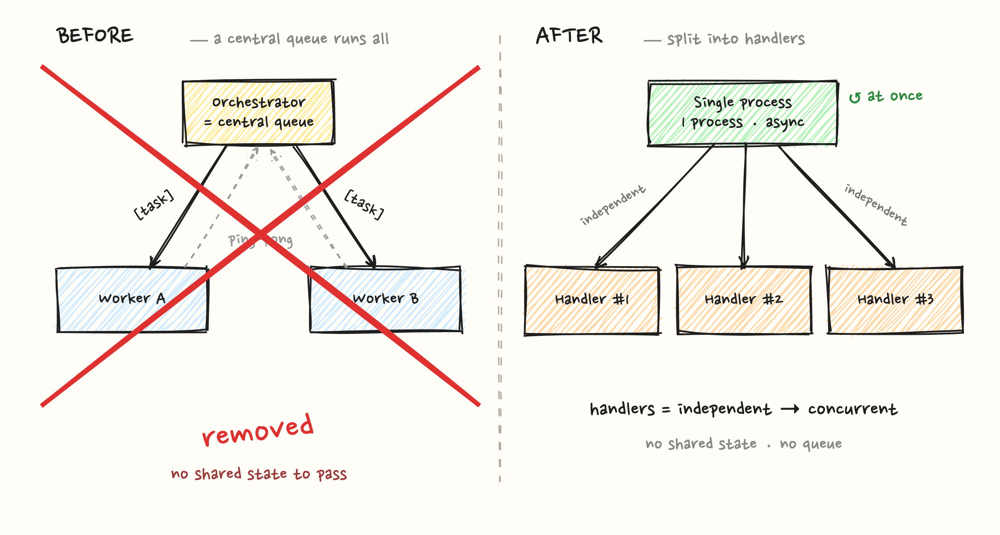
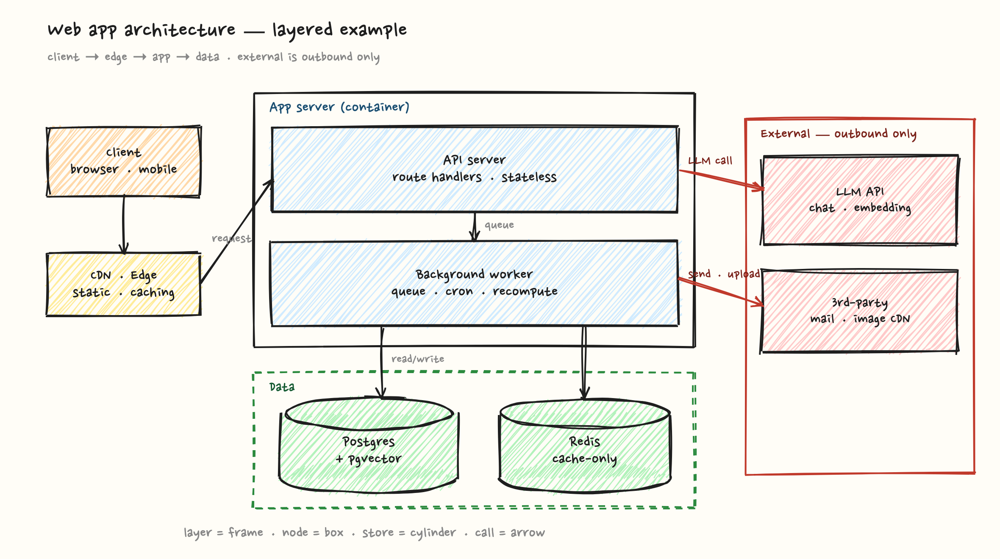

# handdrawn-diagrams

[English](README.md) · **한국어**

손글씨(Excalidraw 스타일) 다이어그램을 외부 앱 없이 만드는 **에이전트 스킬**.
`rough.js` + 한글 손글씨 폰트로 그린 HTML 한 장을 헤드리스 브라우저로 PNG 캡처한다 —
Mermaid 의 "AI가 그린" 밋밋함을 피하고, 소스(HTML)가 남아 언제든 재편집된다.

이 저장소는 단일 소스이자 Claude Code **플러그인**이다(루트가 곧 플러그인,
`skills/handdrawn-diagrams/` 에 스킬 본체). 같은 `SKILL.md` 를 다른 에이전트에서도 그대로 쓴다.

## 미리보기

`examples/` 의 두 레이아웃을 그대로 렌더한 결과:

| before/after (`crossOut` 으로 걷어내기) | 레이어드 아키텍처 |
|---|---|
|  |  |

## 설치

### Claude Code (플러그인)

```
/plugin marketplace add ongjin/handdrawn-diagrams
/plugin install handdrawn-diagrams
```

또는 개인 스킬로 심볼릭링크 (이 repo 를 클론한 뒤):

```bash
git clone https://github.com/ongjin/handdrawn-diagrams.git
ln -s "$PWD/handdrawn-diagrams/skills/handdrawn-diagrams" ~/.claude/skills/handdrawn-diagrams
```

### Codex

```bash
ln -s "$PWD/handdrawn-diagrams/skills/handdrawn-diagrams" ~/.codex/skills/handdrawn-diagrams
```

### 그 외 (Gemini CLI 등)

`SKILL.md` 는 [agentskills.io](https://agentskills.io/specification) 공통 포맷이다.
각 에이전트의 스킬 디렉토리에 `skills/handdrawn-diagrams/` 를 링크하거나 복사하면 된다.

## 사용

```bash
cd skills/handdrawn-diagrams
npm install && npx playwright install chromium   # 최초 1회

cp template.html mydiagram.html                  # draw() 만 채운다
node render.mjs mydiagram.html                   # → mydiagram.png
node render.mjs mydiagram.html --dark            # → mydiagram-dark.png
```

자세한 워크플로·헬퍼·함정은 [`skills/handdrawn-diagrams/SKILL.md`](skills/handdrawn-diagrams/SKILL.md).

## 라이선스

[MIT](LICENSE)
